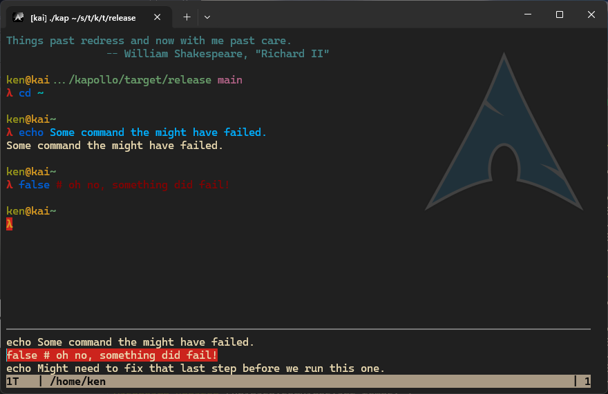

# kapollo

> An Apollo-DM-style split-pad terminal REPL that wraps your real shell.

[](LICENSE)

> ⚠️ **Not ready for prime time (yet!)** — kapollo is at MVP level.
> Linux only; wraps fish and bash, with a fallback for other shells. See
> [docs/specification.md](docs/specification.md) for the full scope.

kapollo (`kap`) wraps your real shell (fish or bash) in a PTY and presents a
two-pane UI: an **input pad** at the bottom where you compose commands, and a
**transcript pad** above where each command and its output appear as a discrete
**block**. Your working directory, environment, aliases, and shell features all
behave exactly as in your normal shell — because it *is* your shell.

The design is inspired by the "command palette + transcript" feel of tools like
Warp's blocks and the Apollo-DM split layout: a focused composition area plus a
scrollable record of what you ran and what came back.

## Screenshot

<!-- TODO: capture a screenshot or asciinema cast of kapollo running and embed
     it here (e.g. ). -->

_A screenshot/cast will be added here._

## Features

- **Command blocks** — each command + its output + exit code is a discrete,
  scrollable block.
- **Real shell** — fish/bash wrapped in a PTY; state persists across commands.
- **Native terminal grid** — output is rendered through a real terminal
  emulator (`wezterm-term`), so progress bars, in-place redraws, and inline
  color display exactly as intended.
- **Precise boundaries** — OSC 133 semantic prompt marks (with a sentinel
  fallback) capture exact command spans and exit codes.
- **Mouse selection & copy** — left-drag to select, right-click to copy a
  selection or a whole block; OSC 52 copy (SSH-friendly) with a local fallback;
  Shift bypasses to the host terminal.
- **Block store** — each block's output is retained in a bounded, canonical
  store that survives scrollback eviction, backing faithful copy.
- **Multiline editing** — Shift+Enter / Alt+Enter insert newlines; Enter
  submits the whole buffer (trailing blank lines are trimmed). Readline-style
  motion and kills (Home/End, Ctrl+Left/Right, Ctrl+U/K/W) and keyboard text
  selection (Shift+arrows).
- **Scrollback** — page and line scroll the transcript (PageUp/PageDown,
  Shift+PageUp/PageDown) with top/bottom jumps (Shift+Home/End), keeping a
  configurable few lines of overlap when paging.
- **Input history** — kapollo's own Up/Down history, separate from the shell's.
- **Full-screen passthrough** — `vim`, `less`, `top` run natively with stdin
  forwarded verbatim; the split-pad UI is restored cleanly on exit.
- **Clean transcript** — borderless pads, a colorized `λ` prompt echoing each
  command, a divider rule above the input, and a fixed status bar showing a mode
  field, the cwd (following `cd`), transient messages, and the last exit code.
- **Slash commands** — `/help`, `/clear`, `/status`, `/keys`, `/quit` (and
  `/exit`), with a `//` escape for a literal leader.
- **Safe by default** — Ctrl-C interrupts the running command (not kapollo); the
  terminal is always restored on exit, error, and panic.

## Install

Requires a stable Rust toolchain (pinned via `rust-toolchain.toml`) on Linux.

```sh
git clone https://github.com/kenhia/kapollo
cd kapollo
cargo install --path .
```

This installs both `kapollo` and the short `kap` alias into `~/.cargo/bin`.

### Build without installing

```sh
cargo build --release
./target/release/kap
```

## Usage

```sh
kap                      # wrap $SHELL
kap --shell /bin/bash    # wrap a specific shell
kap --config ./my.toml   # alternate config file
kap --verbose            # raise log verbosity (repeatable)
kap --help               # full help
```

### Key bindings

Run `/keys` for the full, live list.

| Key | Action |
|-----|--------|
| Enter | Submit the input |
| Shift+Enter / Alt+Enter | Insert a newline (multiline compose) |
| Up / Down | Recall input history |
| Left / Right | Move the cursor one character |
| Ctrl+Left / Ctrl+Right | Move one word |
| Home / End | Start / end of the current line |
| Shift+Left / Shift+Right | Extend the selection by a character |
| Shift+Ctrl+Left / Shift+Ctrl+Right | Extend the selection by a word |
| Ctrl+U / Ctrl+K / Ctrl+W | Kill to line start / end, or the word before |
| PageUp / PageDown | Scroll the transcript a page at a time |
| Shift+PageUp / Shift+PageDown | Scroll a line at a time |
| Shift+Home / Shift+End | Jump to the oldest / newest output |
| Ctrl-C | Copy an active selection, else interrupt the running command |
| Esc / Esc Esc | Cancel a selection / clear the line; Esc Esc clears a multiline buffer and the status message |

Mouse: left-drag selects, right-click copies (the selection, or the block under
the cursor with its command), the wheel scrolls, and Shift bypasses to the host
terminal's native selection. Copy prefers OSC 52 (SSH-friendly) with a local
clipboard fallback.

Slash commands: `/help`, `/clear`, `/status`, `/keys`, `/quit` (alias `/exit`).
See [docs/usage.md](docs/usage.md) for the configuration schema and full details.

## Documentation

- [docs/setup.md](docs/setup.md) — build, install, run
- [docs/usage.md](docs/usage.md) — keys, slash commands, configuration
- [docs/specification.md](docs/specification.md) — combined specification
- [docs/architecture.md](docs/architecture.md) — technical reference

## License

Licensed under the [MIT License](LICENSE).

kapollo's terminal grid uses the `wezterm-term` crate from
[wezterm](https://github.com/wezterm/wezterm) (MIT). Its license is included
under [licenses/wezterm-LICENSE.md](licenses/wezterm-LICENSE.md).
