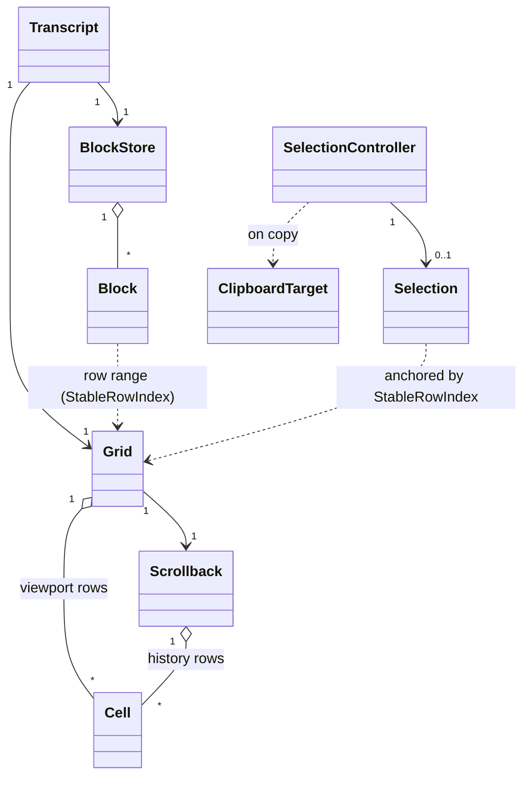

# Data Model — Grid Rework (Phase 1)

Entities, fields, relationships, and state transitions for the grid rework. Types are
conceptual; concrete Rust types may wrap engine types (`wezterm-term`/`termwiz`). Source of
truth for the *interfaces* between these entities is [contracts/](contracts/).

## Entity overview



## Grid

The emulated screen: the live viewport (rows × cols) plus a handle to scrollback. Wraps the
`wezterm-term` `Terminal`/`Screen`.

| Field | Type | Notes |
|-------|------|-------|
| `rows`, `cols` | `u16` | Viewport dimensions; updated on resize (PTY winsize). |
| `viewport` | rows of `Cell` | The currently visible (or scrolled-to) window. |
| `scrollback` | `Scrollback` | History above the viewport. |
| `alt_screen` | `bool` | True while the child holds the alternate screen (`?1049h`). |
| `cursor` | `(row, col)` | Engine cursor position (for render only). |

**Operations** (see [contracts/grid-render.md](contracts/grid-render.md)):
- `advance_bytes(&[u8])` — feed PTY output into the emulator.
- `resize(rows, cols)` — reflow per engine.
- `stable_row_at(viewport_row) -> StableRowIndex` — absolute id for anchoring.
- `changed_rows() -> Range<StableRowIndex>` — damage for incremental render.
- `is_alt_screen_active() -> bool`, `is_mouse_grabbed() -> bool` — routing inputs.

**Validation / invariants**: `0 ≤ cursor.row < rows`, `0 ≤ cursor.col < cols`. On
alt-screen, scrollback is not appended (engine-enforced). `StableRowIndex` is monotonic and
never reused, even after eviction.

## Cell

One grid position: a grapheme cluster plus style. Conceptually the engine's cell; the render
layer maps it to a ratatui styled span.

| Field | Type | Notes |
|-------|------|-------|
| `text` | grapheme cluster | May be wide (2 cols) or zero-width continuation. |
| `fg`, `bg` | color | Mapped to ratatui `Color` at render. |
| `attrs` | bold/italic/underline/reverse/… | Mapped to ratatui `Modifier`. |
| `hyperlink` | optional OSC 8 id | **Retained but not surfaced** in this MVP (FR-024). |

**Validation**: wide-cell continuation cells render as empty and are skipped by the span
builder; selection coord math accounts for wide cells (`coords`).

## Scrollback

History rows above the live viewport, bounded by `Caps`.

| Field | Type | Notes |
|-------|------|-------|
| `rows` | bounded sequence of cell-rows | FIFO; oldest evicted at cap. |
| `cap` | `usize` (from `Caps`) | Config-driven max history rows. |
| `base_stable_index` | `StableRowIndex` | Stable id of the oldest retained row. |

**State transition**: when a row scrolls off the viewport top → appended to scrollback;
when `len > cap` → oldest evicted (its `StableRowIndex` is now below `base_stable_index` and
any block referencing only evicted rows is marked unavailable, see Block).

## Block

A command execution unit: annotation over the grid + retained text. Evolves today's
`session/block.rs` `Block` (which already has `command`, `output: OutputBuffer`,
`exit_code`).

| Field | Type | Notes |
|-------|------|-------|
| `id` | `BlockId` | Monotonic. |
| `command` | `String` | From OSC 133 `B` / prompt capture. |
| `output` | `OutputBuffer` (ringbuf) | Retained bytes/text — canonical `/save` source (R3). |
| `exit_code` | `Option<i32>` | From OSC 133 `D`. |
| `row_range` | `Range<StableRowIndex>` | Grid rows the block occupies (for highlight/jump). |
| `cwd` | `Option<PathBuf>` | From OSC 7. |
| `started_at` | `Option<SystemTime>` | Wall-clock at command execution (OSC 133 `C`, sentinel fallback). Serializable for a future DB backing. |
| `ended_at` | `Option<SystemTime>` | Wall-clock at command end (OSC 133 `D`). |
| `state` | `BlockState` | See transitions. |
| `available` | `bool` | False once all referenced rows evicted *and* output retained-only. |

**Accessors (the DB-ready seam — FR-019/020, SC-010)**:
- `text() -> &str` — output text only.
- `text_with_command() -> String` — command + output.
- `duration() -> Option<Duration>` — derived `ended_at − started_at`; `None` until sealed.
Callers (`/save`, `/filter`, render) use **only** these; a future DB backing implements
them against a secondary store without caller changes.

**State transitions** (`BlockState`):
```text
Started ──OSC133 B──▶ Running ──OSC133 D(exit)──▶ Finished
   │                                                  │
   └──────────── (no marks: sentinel fallback) ───────┘
```
OSC 133 `B` captures the command line (block `begin`); `C` (command execution begins, where
`set_start_row` is called) stamps `started_at`; `Running → Finished` at `D` records
`exit_code`, stamps `ended_at`, and seals `row_range` end. `duration()` becomes available
once `ended_at` is set (true command runtime `C → D`).

**Validation**: `row_range.start ≤ row_range.end`; when both set, `started_at ≤ ended_at`;
`output` bounded by `Caps`; eviction of grid rows never deletes retained `output` (text
survives even when grid rows are gone — that is the whole point of R3).

## BlockStore

In-memory canonical collection of blocks, bounded, behind the text-accessor seam.

| Field | Type | Notes |
|-------|------|-------|
| `blocks` | ordered map `BlockId → Block` | Insertion-ordered. |
| `cap` | `usize` | Max retained blocks (from `Caps`). |
| `index_by_row` | map `StableRowIndex → BlockId` | Fast "which block owns this row" for click-to-jump / highlight. |

**Operations** (see [contracts/block-store.md](contracts/block-store.md)):
- `begin(command, cwd) -> BlockId` (OSC 133 `B`), `set_start_row(id, start_row)` (OSC 133
  `C`, stamps `started_at`), `seal(id, exit_code, end_row)` (OSC 133 `D`, stamps `ended_at`).
- `get(id) -> Option<&Block>`, `block_at_row(StableRowIndex) -> Option<BlockId>`.
- `text(id)`, `text_with_command(id)` — delegate to `Block` accessors.
- `evict_oldest()` — at cap; emits no panic if a referenced block is gone (callers handle
  `None`).

**Future seam (out of scope, designed-for)**: a `SecondaryStore` trait the accessor can
delegate to; a DB implementation is added later with **no** change to `/save`/`/filter`
(SC-010).

## Selection

An in-progress or completed text selection, anchored to stable rows.

| Field | Type | Notes |
|-------|------|-------|
| `anchor` | `(StableRowIndex, col)` | Where the drag began. |
| `cursor` | `(StableRowIndex, col)` | Current drag end. |
| `mode` | `Char` \| `Word` \| `Line` | MVP: char (word/line deferred unless cheap). |
| `active` | `bool` | True while highlighted. |

**Anchoring**: stable-row ids mean the highlight does **not** drift when new output scrolls
the viewport (FR-008, R6).

## SelectionController (FSM)

Owns selection lifecycle + clipboard hand-off. Promoted from spike `selection.rs`.

**States**: `Idle → Dragging → Active → (Idle)`.

```text
Idle ──MouseDown(no Shift, kapollo owns mouse)──▶ Dragging
Dragging ──MouseDrag──▶ Dragging (update cursor, repaint highlight)
Dragging ──MouseUp──▶ Active (selection complete; copy on release per config)
Active ──Copy hotkey / release──▶ Active (text → ClipboardTarget)
Active ──command submitted (FR-017) / new MouseDown / Esc──▶ Idle (clear)
any ──alt-screen or child mouse-mode ON──▶ suspended (route to child, no selection)
any ──Shift held──▶ bypass (host-terminal native selection)
```

**Validation / invariants**: clearing on command submit (FR-017) resolves the spike's
flood-overrun caveat — a stale selection cannot persist across a new command. While
suspended (alt-screen/child mouse-mode), no selection state is created.

## Clipboard Target

The destination of a copy, with fallback.

| Field | Type | Notes |
|-------|------|-------|
| `primary` | `Osc52` | Terminal-mediated; SSH-friendly. |
| `fallback` | `LocalArboard` | Used when OSC 52 unavailable/unhonored. |
| `order` | config | Which to try first; total-failure surfaces a notice (FR-013). |

**State**: copy attempts `primary` then `fallback` (per `order`); on both failing, a visible
status notice is shown — never a silent drop.

## Relationship to existing code

- `session/block.rs::Block` already carries `command + output(OutputBuffer) + exit_code`;
  this model **adds** `row_range`, `cwd`, `state`, `available`, and the two text accessors.
- `session/ringbuf.rs::OutputBuffer` is reused unchanged as the bounded retainer (`Caps`).
- `Grid`/`Scrollback`/`Cell` are **new**, wrapping `wezterm-term`.
- `Selection`/`SelectionController`/`coords`/`clipboard` are **promoted** from the 003
  `spike-support` + `selection.rs`.
