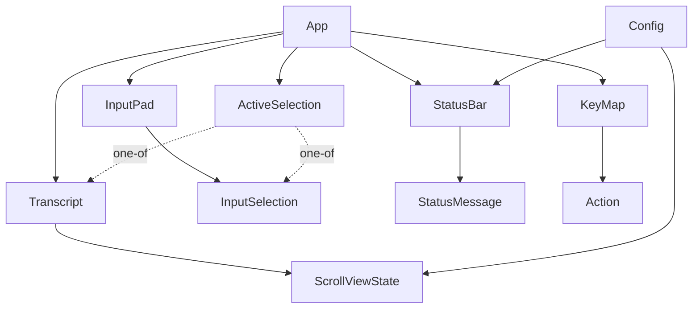

# Phase 1 Data Model: Input Editing & Fixed Status Bar

**Feature**: 005-input-and-status | **Date**: 2026-06-05
**Source**: [spec.md](spec.md) Key Entities + [research.md](research.md) decisions

These are **in-memory runtime structures** (no persistence). Field names are
indicative; the implementation may refine them so long as the contracts in
[contracts/](contracts/) hold. Existing types are noted as *(extend)*.

---

## 1. Input Buffer *(extend `src/input::InputPad`)*

The editable contents of the input pad: a flat UTF-8 string with embedded `\n`
line breaks and a char-indexed caret. The target of all motion, selection, and
kill actions, which operate on the **current line** (FR-007).

| Field | Type | Notes |
|-------|------|-------|
| `buffer` | `String` | UTF-8 text; `\n` separates logical lines (existing). |
| `cursor` | `usize` | Caret as a **char** offset into `buffer` (existing). |
| `selection` | `Option<InputSelection>` | Present iff an input-pad selection is active (new; see §2). |

**Derived (existing, reused)**: `line_count()`, `cursor_row_col() -> (row, col)`,
`is_empty()`, `as_str()`. New derived helpers (pure, in `editing.rs`):
- `current_line_bounds() -> (start_char, end_char)` — char range of the line the
  caret is on (between surrounding `\n`s / buffer ends).
- `word_boundary_left(from) -> usize` / `word_boundary_right(from) -> usize` —
  punctuation-aware (FR-002).
- `delete_word_before_bounds(from) -> (start, from)` — whitespace-rule (FR-006).

**Validation / invariants**:
- `0 <= cursor <= char_count(buffer)`.
- `is_multiline() == buffer.contains('\n')`.
- All motion clamps to `current_line_bounds()` except the (reserved, unmapped)
  whole-buffer motions (FR-009).

**State transitions** (current-line scope; FR-001–FR-007):

```text
line_move_start   : cursor → current_line_bounds().0
line_move_end     : cursor → current_line_bounds().1
word_move_left    : cursor → word_boundary_left(cursor)      (clamped to line start)
word_move_right   : cursor → word_boundary_right(cursor)     (clamped to line end)
kill_to_line_start: delete [current_line_bounds().0, cursor); cursor → line start
kill_to_line_end  : delete [cursor, current_line_bounds().1)
delete_word_before: delete delete_word_before_bounds(cursor); cursor → start of deleted
insert(text)      : insert at cursor (paste splits on '\n'); cursor → end of insert
```

---

## 2. Input Selection *(new `src/input::InputSelection`)*

A character-anchored range within the Input Buffer.

| Field | Type | Notes |
|-------|------|-------|
| `anchor` | `usize` | Char offset where the selection started. |
| `caret` | `usize` | Char offset of the moving end (tracks `cursor`). |

**Derived**: `range() -> (min, max)` (normalized), `is_empty() == anchor == caret`.

**Transitions** (FR-003/FR-004):

```text
select_char_left  : if None → anchor=caret=cursor; caret = caret-1; cursor=caret
select_char_right : if None → anchor=caret=cursor; caret = caret+1; cursor=caret
select_word_left  : if None → anchor=caret=cursor; caret = word_boundary_left(caret)
select_word_right : if None → anchor=caret=cursor; caret = word_boundary_right(caret)
cancel (Esc)      : selection → None
copy  (Ctrl+C)    : copy range() text; selection → None
```

Selection is **subordinate to the single-selection arbiter** (§4): creating an
input selection clears any transcript selection.

---

## 3. Named Action & Key Map *(new `src/action`)*

The unit the sprint-006 keymap engine will bind. This sprint each mapped action has
exactly **one hardcoded default** binding.

### Action

| Field | Type | Notes |
|-------|------|-------|
| *(variant)* | `enum Action` | One variant per named action below + 2 reserved. |

**Mapped actions** (default binding in parentheses):

| Action | Default key | FR |
|--------|-------------|----|
| `LineMoveStart` | `Home` | FR-001 |
| `LineMoveEnd` | `End` | FR-001 |
| `WordMoveLeft` | `Ctrl+Left` | FR-002 |
| `WordMoveRight` | `Ctrl+Right` | FR-002 |
| `SelectCharLeft` | `Shift+Left` | FR-003 |
| `SelectCharRight` | `Shift+Right` | FR-003 |
| `SelectWordLeft` | `Shift+Ctrl+Left` | FR-004 |
| `SelectWordRight` | `Shift+Ctrl+Right` | FR-004 |
| `KillToLineStart` | `Ctrl+U` | FR-005 |
| `KillToLineEnd` | `Ctrl+K` | FR-005 |
| `DeleteWordBefore` | `Ctrl+W` | FR-006 |
| `ScrollPageUp` | `PageUp` | FR-013 |
| `ScrollPageDown` | `PageDown` | FR-013 |
| `ScrollLineUp` | `Shift+PageUp` | FR-015 |
| `ScrollLineDown` | `Shift+PageDown` | FR-015 |
| `ScrollToTop` | `Shift+Home` | FR-016 |
| `ScrollToBottom` | `Shift+End` | FR-016 |

**Contextual gesture (named, but NOT a static chord binding):**

| Action | Trigger | FR |
|--------|---------|----|
| `ClearStatusMessage` | `Esc Esc` (two-key sequence; arbitrated by §4, not the chord table) | FR-026 |

`ClearStatusMessage` is a named `Action` (so `/keys` can list it) but is **not** in
`default_bindings()`/`resolve` because `Esc Esc` is a contextual two-key gesture, not a
single `KeyChord` (see the KeyMap note below).

**Reserved, unmapped actions** (named, **no** default binding; FR-009):

| Action | Binding | FR |
|--------|---------|----|
| `MultilineMoveStartBuffer` | *(none)* | FR-009 |
| `MultilineMoveEndBuffer` | *(none)* | FR-009 |

### KeyMap

| Field | Type | Notes |
|-------|------|-------|
| *(static table)* | `&[(Action, KeyChord, &str name)]` | Hardcoded; mapped actions only. |

**Derived**: `resolve(chord) -> Option<Action>` (used by `on_key`),
`listing() -> Vec<(name, chord_display)>` (used by `/keys`, FR-030).

**Validation**: every action in the **Mapped actions** table appears exactly once in
`default_bindings()`; reserved actions and `ClearStatusMessage` appear in `Action` but
**not** in the table; no two mapped actions share a chord.

> Note: `Esc`/`Esc Esc`/`Ctrl+C`/`Enter`/printable insertion remain context-sensitive
> in `on_key` (their meaning depends on selection/buffer state per FR-028/FR-029) and
> are documented in `/keys` but arbitrated by §4, not by a static chord→action lookup.
> `ClearStatusMessage` (`Esc Esc`) is one such contextual gesture: a named `Action`
> for `/keys` listing, but not a `KeyChord` in `default_bindings()`/`resolve`.

---

## 4. Active Selection Arbiter *(new, in `src/app::App`)*

Enforces "at most one selection across both pads" (FR-027) structurally.

```text
enum ActiveSelection {
    None,
    Input(InputSelection),       // lives in the input pad (§2)
    Transcript(/* 004 range */), // lives in the output/transcript pad
}
```

**Invariant**: at most one pad has a selection — unrepresentable otherwise.

**Transitions**:

```text
start input selection      → ActiveSelection::Input(...)   (clears any Transcript)
start transcript selection → ActiveSelection::Transcript(..)(clears any Input)
Ctrl+C with Some           → copy + ActiveSelection::None   (FR-028)
Ctrl+C with None           → SIGINT to child               (FR-028)
Esc with Some              → cancel → None                  (FR-029)
```

---

## 5. Scroll View State *(extend `src/session::Transcript`)*

| Field | Type | Notes |
|-------|------|-------|
| `scroll_offset` | `usize` | Lines from bottom (existing). |
| `viewport` | `Cell<usize>` | Recorded page height (existing). |
| `max_scroll` | `Cell<usize>` | Top-of-content clamp (existing). |
| `context_lines` | from config | `scroll.context_lines`, default **3** (new; §7). |

**Transitions** (FR-013–FR-016):

```text
scroll_page_up(ctx)   : offset += (viewport - ctx).max(1); clamp ≤ max_scroll
scroll_page_down(ctx) : offset -= (viewport - ctx).max(1); clamp ≥ 0
scroll_line_up        : offset += 1; clamp ≤ max_scroll   (existing scroll_up(1))
scroll_line_down      : offset -= 1; clamp ≥ 0            (existing scroll_down(1))
scroll_to_top         : offset = max_scroll              (existing)
scroll_to_bottom      : offset = 0                       (existing)
```

**Validation**: `0 <= scroll_offset <= max_scroll`; page advance is always ≥ 1 line.

---

## 6. Status Bar & Status Message *(extend `src/ui/status` + `src/app::App`)*

### Status Bar

A single fixed-layout chrome line beneath the input pad (FR-018–FR-024).

| Field | Type | Notes |
|-------|------|-------|
| `enabled` | `bool` | From config `[status] enabled`, default **true**; toggled by `/status` (FR-022). |
| `mode` | mode label | 4-char mixed-case field; the default shell mode renders as the literal `norm` this sprint (FR-020). |
| `cwd` | `&Path` | From `App.cwd` (FR-023). |
| `message` | `Option<String>` | The Status Message (§below); right-justified (FR-019). |
| `exit` | `Option<i32>` | Most-recent completed command's exit code (FR-023). |

**Render rule** (pure `fit(width, …) -> String`; FR-019/FR-024, research R4):
layout `mode | cwd<greedypad>| message | exit`; reserve mode+exit, fill middle, the
greedy pad sits between `cwd` and the `|` (no `|` *immediately* after `cwd`), message
right-justified; under width pressure truncate `message` (ellipsis) then `cwd`
(middle-ellipsis), **never** break `mode`/`exit`, **never** wrap.

**Visibility** (FR-021): rendered iff `enabled && terminal_rows >= 10`; auto-hidden
below 10 rows regardless of `enabled`, reappearing at ≥ 10.

### Status Message *(reuses `App.notice` backing)*

| Field | Type | Notes |
|-------|------|-------|
| `message` | `Option<String>` | Transient `message` content. |

**Lifetime** (FR-025/FR-026, **no timeout**):

```text
set(text)        : message = Some(text)
submit (Enter)   : message = None       (clearing on submit, FR-025)
Esc Esc          : message = None       (clear_status_message, FR-026)
```

---

## 7. Configuration surface *(extend `src/config::Config`)*

Adds to the existing config (existing keys unchanged; FR-033). See
[contracts/config additions](contracts/status-bar.md#config).

| Key | Type | Default | Notes |
|-----|------|---------|-------|
| `status.enabled` | `bool` | `true` | Status bar on/off (FR-018/FR-022). |
| `scroll.context_lines` | `u16` | `3` | Page-scroll overlap; clamps page advance ≥ 1 (FR-014). |

**Validation**: unknown keys logged & ignored (existing policy); `context_lines` is
not separately capped (the ≥ 1-line floor is applied at scroll time, not at parse).

---

## Entity relationship summary


