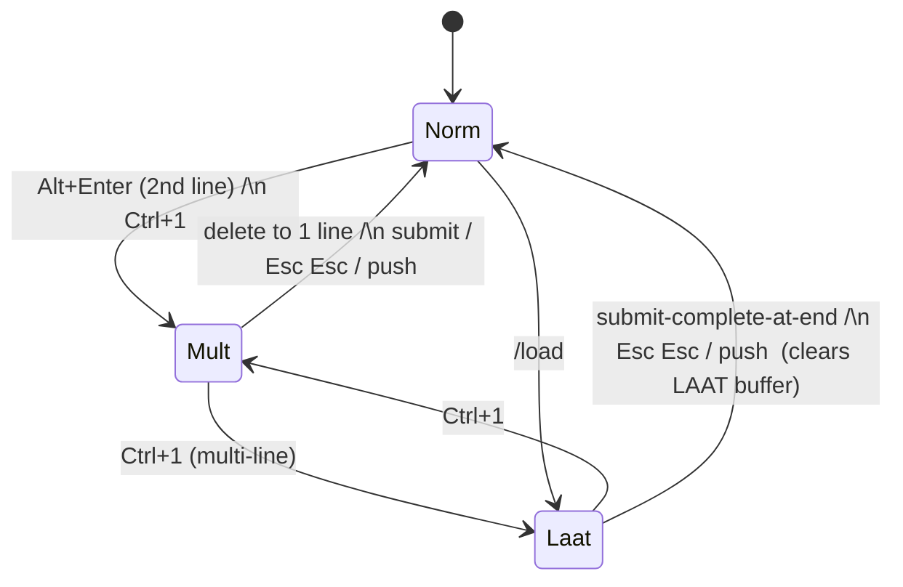

# Contract: Input Modes & Mode-Aware Navigation

**Feature**: 007-laat-mode | **Phase**: 1 | Internal interface contract

Covers the `InputMode` state machine, mode-aware `Up`/`Down`, and chat-style edge
recall. Realizes FR-008…FR-017. This is an **internal** (in-process) contract; the
"interface" is the behavior `App::on_key` exposes per mode.

## 1. Mode state machine

States: `Norm`, `Mult`, `Laat`. Status labels: `norm`, `Mult`, `1T`.

| From | Trigger | To | Notes |
|------|---------|----|-------|
| `Norm` | `Alt+Enter` (`InsertNewline`, buffer becomes 2 lines) | `Mult` | FR-008 |
| `Norm` | `Ctrl+1` (`ToggleMultLaat`) | `Mult` | even empty/1-line, FR-015 |
| `Mult` | `Ctrl+1` | `Laat` | only when multi-line, FR-016 |
| `Laat` | `Ctrl+1` | `Mult` | FR-016 |
| `Mult` | delete back to a single line | `Norm` | FR-012 |
| `Mult`/`Laat` | `Esc Esc`, submit, or push | `Norm` | FR-014; leaving `Laat` clears the LAAT buffer (FR-007) |
| `Norm` | `/load <file>` | `Laat` | lines loaded, first highlighted (FR-028) |

Edge: `Ctrl+1` on a single-line `Norm` buffer enters `Mult`; it does **not**
jump straight to `Laat` (LAAT requires a multi-line buffer to step through).

## 2. Mode-aware `Up` / `Down`

`App::on_key` dispatches `Up`/`Down` by `self.mode`:

| Mode | `Up` | `Down` |
|------|------|--------|
| `Norm` | `history.recall_older` → `set_contents` (unchanged) | `history.recall_newer` → `set_contents` (unchanged) |
| `Mult` / `Laat`, caret not at first line | `caret_line_up` (column-preserving) | — |
| `Mult` / `Laat`, caret not at last line | — | `caret_line_down` |
| `Mult` / `Laat`, caret on first line | **edge recall**: stash draft + `recall_older` | — |
| `Mult` / `Laat`, caret on last line, recalling | — | **edge restore**: return to stashed draft |

- In `Laat`, caret motion also moves the **highlight** to the caret's line.
- Column preservation: `caret_line_up/down` keep the visual column where the target
  line is long enough, else clamp to the target line's end.

## 3. Chat-style edge recall (stashed draft)

Realizes FR-010/FR-011, SC-002/SC-003.

1. Caret on the first line, buffer is a live draft (not currently recalling):
   `Up` **stashes** the entire current buffer and recalls the previous history
   entry (`set_contents` of the entry).
2. Continued `Up` walks older entries (no re-stash).
3. `Down` walks newer entries; stepping **past the newest** entry **restores the
   stashed draft** byte-for-byte and returns to the live-draft state. `Down` never
   recalls older entries (there is no distinct bottom-edge recall).
4. The stash persists across mode switches and a push/pop round-trip (it is part of
   `InputSnapshot`); it is only consumed by restoring-and-editing the draft.

## 4. Behavioral contract (testable)

- C1: From `Norm` with `"abc"`, `Alt+Enter` then typing `"def"` ⇒ mode `Mult`,
  buffer `"abc\ndef"` (covers FR-008).
- C2: From empty `Norm`, `Ctrl+1` ⇒ mode `Mult`, buffer empty (FR-015).
- C3: From multi-line `Mult`, `Ctrl+Alt+1` ⇒ mode `Laat`; again ⇒ `Mult` (FR-016).
- C4: In `Mult` with caret on line 2 of `"a\nb"`, `Up` ⇒ caret on line 1, **no**
  history recall, buffer unchanged (FR-009).
- C5: In `Mult` with caret on line 1, history `["old"]`, `Up` ⇒ buffer `"old"`,
  draft stashed; `Down` past newest ⇒ original buffer restored (FR-010, SC-002/3).
- C6: In `Mult`, delete the only newline so one line remains ⇒ mode `Norm` (FR-012).
- C7: Plain `Enter` in `Mult` ⇒ whole buffer submitted as one submission (FR-013).
- C8: Selecting multiple lines then `Enter` in any mode ⇒ one combined submission,
  not sequential gated steps (FR-017).

All of C1–C8 are unit-testable against `InputPad` + `InputHistory` + a mode field;
the live-TTY rendering of the mode label uses the Constitution III manual
exception (quickstart).
