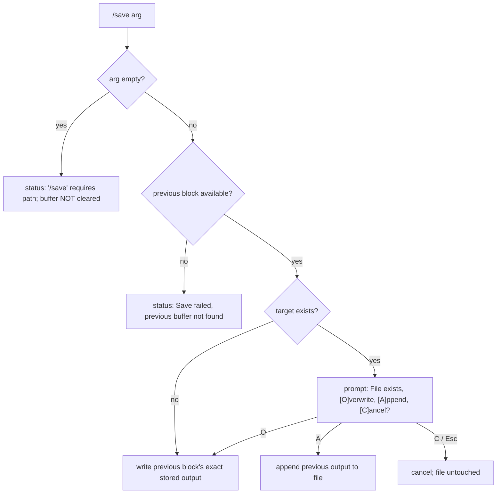
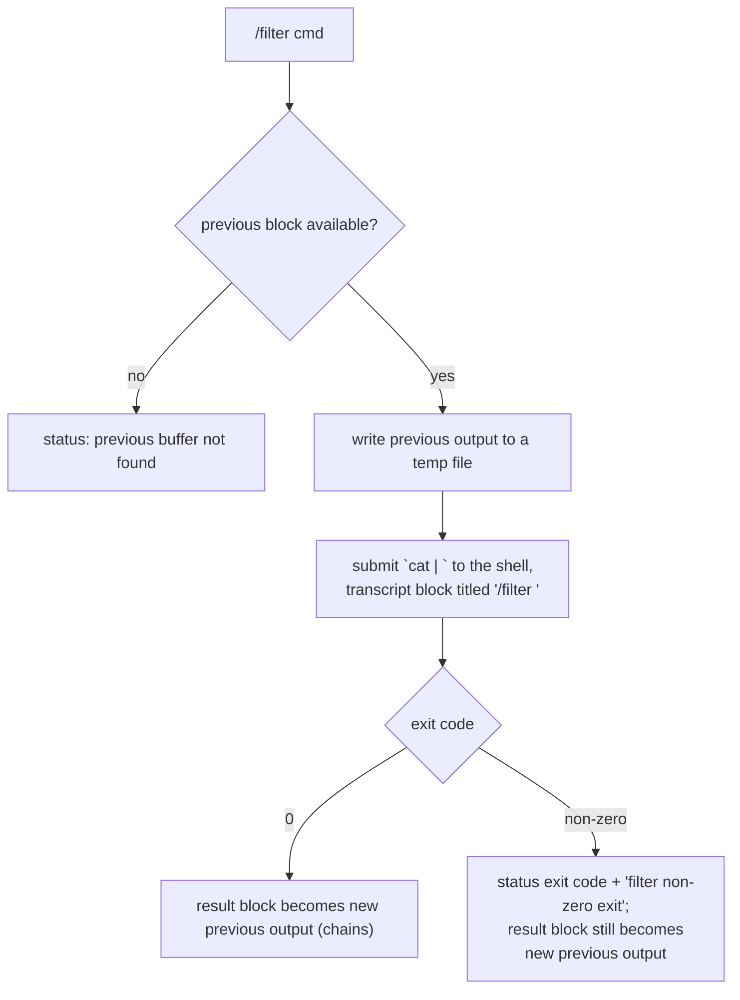

# Contract: Slash Commands `/save`, `/filter`, `/load`

**Feature**: 007-laat-mode | **Phase**: 1 | Internal interface contract

Covers the three new slash commands and the `/save` overwrite prompt. Realizes
FR-021…FR-028, FR-030. Extends the sprint-006 slash registry.

## 1. Dispatch surface (`src/slash/mod.rs`)

New argument-bearing `SlashCommand` variants (research R6):

| Input line | Dispatch |
|------------|----------|
| `save <path>` | `Command(Save("<path>"))` |
| `save` (no arg) | `Command(Save(""))` |
| `filter <cmd>` | `Command(Filter("<cmd>"))` (raw remainder, pipes preserved) |
| `load <path>` | `Command(Load("<path>"))` |

The verb is matched case-sensitively; the payload is the trimmed remainder of the
line. Empty payloads still dispatch (so `/save` reaches its status path, not the
unknown-command path). `App::run_slash` handles each variant.

## 2. `/save <file>` (FR-021…FR-024)

Path resolution: relative to `App.cwd` (which follows `cd`), with leading `~`
expanded to the home directory.

- **No path** (FR-022): status message `'/save' requires path`; the input buffer is
  **not** cleared so the user can add a path and resubmit, or `Esc`.
- **Previous block missing/evicted** (FR-024): status message
  `Save failed, previous buffer not found`.
- **Existing file** (FR-023): set a `PendingPrompt { path, bytes }`; `App::on_key`
  consumes the next key first — `o/O` overwrite, `a/A` append, `c/C`/`Esc` cancel;
  any other key keeps the prompt up.
- **Content**: the previous block's **exact stored output** (`BlockStore::text` of
  the most recent sealed block) — bytes, not a re-render.
- Filesystem write is a system-boundary op (Constitution VII): errors surface as a
  status message, never a panic.

## 3. `/filter <cmd>` (FR-025…FR-027)

- Runs `<cmd>` **via the shell** (pipes/globs/aliases work) by piping the previous
  block's output into it (FR-025).
- The result is a normal captured transcript block **titled** `{leader}filter <cmd>`
  (the effective configured leader char, as with `/help`/`/keys`); being a normal
  block, it **becomes the new previous output**, so a subsequent `/filter` chains
  on it (FR-026).
- Non-zero exit (FR-027): `last_exit` reflects it **and** a `filter non-zero exit`
  status message is shown (non-zero is often fine, e.g. a no-match `rg`).
- The temp file is uniquely named under the system temp dir and removed
  best-effort after completion.

## 4. `/load <file>` (FR-028)

- Resolve the path relative to `App.cwd` with `~` expansion.
- Read the file's lines (one command per line) into the input buffer, enter `Laat`
  with the **first line highlighted**.
- A missing/unreadable file fails with a status message and does **not** enter
  `Laat` with a partial buffer (edge case).

## 5. Help & discoverability (FR-030/FR-031)

`builtins::help_text` lists `/save`, `/filter`, and `/load` with one-line
descriptions alongside the existing commands. The two new keymap actions are listed
by `/keys` (see [keymap-actions.md](keymap-actions.md)).

## 6. Behavioral contract (testable)

- S1: `/save` (no arg) ⇒ status `'/save' requires path`; buffer unchanged (FR-022).
- S2: `/save out.txt` with a previous block ⇒ file `out.txt` equals the previous
  block's stored output exactly (FR-021).
- S3: `/save out.txt` when `out.txt` exists ⇒ a prompt is pending; `O` overwrites,
  `A` appends, `C`/`Esc` cancels leaving the file untouched (FR-023).
- S4: `/save x` with no previous block ⇒ status `Save failed, previous buffer not
  found` (FR-024).
- S5: dispatch of `/filter rg foo | sort` ⇒ `Filter("rg foo | sort")` (raw payload
  preserved for the shell, FR-025).
- S6: `/filter` result block's title is `/filter <cmd>` and it is the new previous
  output for a chained `/filter` (FR-026).
- S7: `/filter` with a non-zero exit ⇒ `last_exit` set and `filter non-zero exit`
  message (FR-027).
- S8: `/load script` ⇒ each line a buffer line, mode `Laat`, highlight on line 0
  (FR-028).

Dispatch parsing (S1, S5), path resolution, and the save/append byte content
(S2–S4) are unit-testable; the live prompt key-handling and `/filter` shell
round-trip use the Constitution III manual exception (quickstart).
