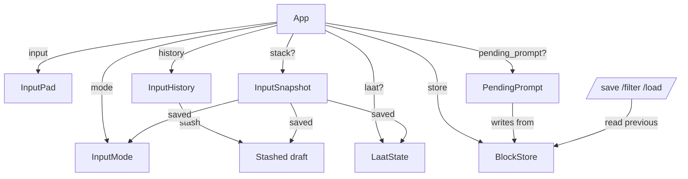

# Data Model: LAAT Mode, `/save`, `/filter`, and `/load`

**Feature**: 007-laat-mode | **Date**: 2026-06-07 | **Phase**: 1

This feature is overwhelmingly **interaction state**, not persisted data. The
entities below are in-memory types added to or extended in the existing crate.
No new storage, no serialization beyond the existing `[keymap]` config surface
(006). References to source files use repository-relative paths.

## Entities

### `InputMode` (new — `src/input` or `src/action`)

The current editing mode of the input buffer, surfaced in the status bar's
reserved 4-column mode field.

| Variant | Status label | Meaning |
|---------|--------------|---------|
| `Norm`  | `norm` | Single-line / default editing; `Up`/`Down` recall history. |
| `Mult`  | `Mult` | Multi-line editing; `Up`/`Down` move the caret, with edge recall. |
| `Laat`  | `1T` (full `LaaT`) | `Mult` + highlight + step + exit-code gating. |

- `label() -> &'static str` → the 4-column status string (`"norm"`/`"Mult"`/`"1T"`).
- **Transitions** (see [contracts/input-modes.md](contracts/input-modes.md)):
  - `Norm → Mult`: `Alt+Enter` adds a 2nd line (FR-008); or `Ctrl+1` from
    `Norm` even on an empty/single line (FR-015).
  - `Mult → Laat` / `Laat → Mult`: `Ctrl+1` toggle when multi-line (FR-016).
  - `Mult → Norm`: delete back to a single line (FR-012).
  - `Mult`/`Laat` → `Norm`: submit, `Esc Esc`, or push (FR-014); leaving `Laat`
    clears the LAAT buffer (FR-007).

### `InputPad` (extended — `src/input/mod.rs`)

The existing pure text+cursor+selection buffer. Extended with **vertical caret
motion** (it currently has only horizontal/line-relative motion).

New behavior (no new fields; derived from `buffer` + `cursor`):
- `caret_line_up()` — move the caret up one buffer line, preserving the target
  column where possible (clamped to that line's length). No-op stash/recall here;
  edge detection is the caller's (`App`) job.
- `caret_line_down()` — symmetric downward.
- `caret_on_first_line() -> bool` / `caret_on_last_line() -> bool` — edge tests the
  caller uses to decide between caret motion and chat-style history recall.

Invariants: caret stays within `[0, char_count()]`; column preservation uses the
existing `offset_row_col` / line-bounds helpers; selection is collapsed on motion
(consistent with the other motions).

### `InputHistory` (extended — `src/input/mod.rs`)

The existing in-session history with a recall cursor (`cursor: Option<usize>`,
`None` = live draft). Extended to own the **stashed draft** for chat-style edge
recall (research R3).

| Field | Type | Notes |
|-------|------|-------|
| `entries` | `Vec<String>` | unchanged |
| `cursor` | `Option<usize>` | unchanged (`None` = live draft) |
| `stash` | `Option<String>` | **new** — the buffer stashed when edge recall begins |

- Begin edge recall: stash the current draft (passed in by the caller) on the first
  older-step from the live draft, then return the previous entry.
- Step newer past the newest entry: return the **stash** (restoring the draft) and
  reset `cursor`/`stash` to the live-draft state.
- The stash is part of the push/pop snapshot (`InputSnapshot`) so it survives a
  round-trip (FR-011, SC-003).

### `LaatState` (new — `src/input` or `src/app.rs`)

The stepping state that exists only while `mode == Laat`.

| Field | Type | Notes |
|-------|------|-------|
| `highlight` | `usize` | index of the currently highlighted buffer line |
| `failed_lines` | set of `usize` | lines flagged as **probable** failures |
| `pending` | `Option<usize>` | the line last submitted, awaiting completion |

- The highlight tracks the caret line during `Up`/`Down` navigation.
- On `Enter`: submit the highlighted line(s) as a normal submission; set `pending`.
- On `CommandEnd { exit_code }` while `pending` is set:
  - exit `0` → advance `highlight` to the next line, clear `pending`, clear that
    line's failure flag.
  - non-zero → keep `highlight`, insert it into `failed_lines`, clear `pending`.
- Leaving LAAT discards `LaatState` and clears the LAAT buffer (FR-007).

### `InputSnapshot` (new — push/pop stack entry, `src/app.rs`)

The single saved state for the one-item push/pop stack (research R7).

| Field | Type | Notes |
|-------|------|-------|
| `buffer` | `String` | the saved input text |
| `cursor` | `usize` | caret position |
| `mode` | `InputMode` | the saved mode (`Mult`/`Laat`/`Norm`) |
| `stash` | `Option<String>` | the saved chat-style stash (FR-011) |
| `laat` | `Option<LaatState>` | saved LAAT stepping state when mode was `Laat` |

Held on `App` as `Option<InputSnapshot>` (single item). `PushInput` saves it (no-op
if already occupied — one-item semantics, FR-020); the next `submit` pops and
restores it.

### `PendingPrompt` (new — `/save` overwrite confirmation, `src/app.rs`)

The transient one-key confirmation state for `/save` to an existing file
(research R9, FR-023).

| Field | Type | Notes |
|-------|------|-------|
| `path` | `PathBuf` | resolved target (cwd-relative, `~`-expanded) |
| `bytes` | `Vec<u8>` | the previous block's exact stored output to write |

Held on `App` as `Option<PendingPrompt>`. While set, `App::on_key` consumes the
next key first: `o/O` overwrite, `a/A` append, `c/C`/`Esc` cancel; other keys keep
the prompt up.

### `Action` (extended — `src/action/mod.rs`)

Two new named, rebindable actions added to the 006 keymap engine (research R10).

| Variant | `name()` | Default binding | Behavior |
|---------|----------|-----------------|----------|
| `ToggleMultLaat` | `toggle_mult_laat` | `Ctrl+1` | `Norm→Mult`; toggles `Mult↔Laat` when multi-line. |
| `PushInput` | `push_input` | `Ctrl+Alt+Enter` | Push buffer+mode (R7). |

Both are added to `Action::name`, `Action::from_name`, the `default_map`,
`dispatch_action`, and `docs/keymap-defaults.toml` (kept in sync by the existing
`keymap_defaults_doc` test). The 006 key-string parser already accepts both
default key strings — no parser change.

### `SlashCommand` (extended — `src/slash/mod.rs`)

Three new argument-bearing variants (research R6).

| Variant | Verb | Payload |
|---------|------|---------|
| `Save(String)` | `save` | target file path (may be empty → status error) |
| `Filter(String)` | `filter` | the filter command (raw, passed to the shell) |
| `Load(String)` | `load` | script file path |

`slash::dispatch` matches the verb, then carries the trimmed remainder of the line
as the payload. Empty payloads still dispatch (so `/save` with no path reaches its
status-message path rather than the unknown-command path).

## Relationships

## Status-bar integration

`crate::ui::status::render` currently passes the hardcoded `DEFAULT_MODE` to
`fit`. It changes to pass `app.mode.label()`. `MODE_WIDTH` (4) and the existing
`fit_mode` padding/truncation are unchanged; `"1T"` renders padded in the 4-column
field, `"Mult"` fills it exactly.
